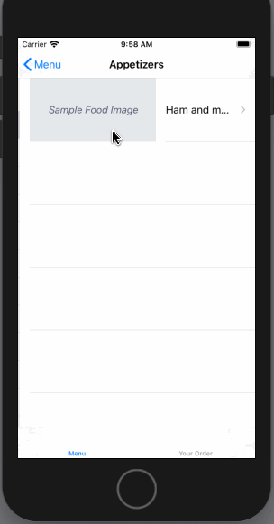

# Restaurant Menu

Restaurant Menu is a client app for a web API that serves a list of menu items for a restaurant.

Submitted by: Raquel Santos

Time spent: 2 days

## User Stories

The following **required** functionality is complete:

* [x] Display the list of available items

* [x] Add items to an order.

* [x] Display the current order.

* [x] Add items to an order.

* [x] Submit the order.

* [ ] Add networking code to create the proper URLs, perform the requests, and process the JSON results.

The following **additional** features are implemented:

* [ ] Enable error handling that will inform the user if the app is unable to retrieve data from the server.

* [ ] Create a local notification that's displayed 10 minutes before the order will be ready.

* [ ] Add data persistence and state restoration so interrupted orders can be resumed.

* [ ] List anything else that you can get done to improve the app functionality!

## Video Walkthrough 

Here's a walkthrough of implemented user stories:

## Notes

Describe any challenges encountered while building the app.

## License

Copyright 2020 Raquel Santos

Licensed under the Apache License, Version 2.0 (the "License");
you may not use this file except in compliance with the License.
You may obtain a copy of the License at

http://www.apache.org/licenses/LICENSE-2.0

Unless required by applicable law or agreed to in writing, software
distributed under the License is distributed on an "AS IS" BASIS,
WITHOUT WARRANTIES OR CONDITIONS OF ANY KIND, either express or implied.
See the License for the specific language governing permissions and
limitations under the License.
